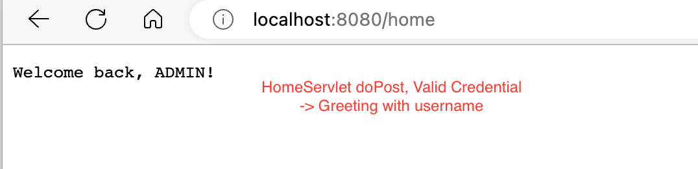

# r01_UserAuth - A servlet web app of user authentication
## About
This is a web app build with JavaEE (Jakarta) Servlet, backed by MySQL Database.
The user can log in via a web form.

The home servlet will validate the HTTP request with the user inputs.
### doPost, valid credential

### doPost, invalid credential

### doGet -> Request forwarded to the login page

## Prerequisites
* MySQL 8.0.33-arm64
* TomCat 10.1.10
## Dependencies
* jakarta.servlet:jakarta.servlet-api:6.0.0
* mysql:mysql-connector-j:8.0.33
* junit:junit:4.13.2

## Development Process
### 1. Project Set Up
* Create a new JavaEE (JakartaEE) project with type set to `Web Application`;
* (Optional) Update the URL and context path for the TomCat configuration (eg. http://localhost:8080/) for easier access;
* Create `login.html` under **_/src/main/webapp_**, with HTML and/or JavaScript. This page is used to log in and contains a POST method `<form>` with three `<input>` elements:
    * Username text input
    * Password text input
    * Login submission button
* Add dependencies to the module via Maven. See Prerequisites for packages needed.

### 2. Define Data Model
* Database set up. See SQL under **_/src/test/resources/DataPreparation.sql_**
* Create JavaBean for Credential under **_/src/main/java/model/_**.
* Create Data Access Object (DAO) for Credential under **_/src/main/java/model/_**.

### 3. Define JDBC Connection & Connection Pool
* Creat a JDBC utility class under **_/src/main/java/utilities/_**. This utility class will contain:
  * Connection getter
  * Clean up function that closes ResultSet, Statement and Connection.

### 4. Define CRUD Operations in the DAO class
* Add a `login` method with prepared statement of SQL-DQL.
* Set values with values submitted via the web form.
* Query with SQL and handle the result.

### 5. DAO Testing
* Define a private testing method of logging in and returning a Credential
* Add assertions for successful and failed login attempts.

### 6. Login Logic
* Define a HomeServlet under **_/src/main/java/main_**.
* Extend teh servlet class with HttpServlet
* Implement doGet and doPost methods
* Make the urlPattern or context path the action of the HTML form

## My Dev Environment
* Prerequisites mentioned above.
* Dependencies mentioned above.
* macOS 14.0 23A5257q
* MS Edge 114.0.1823.55
* IDEA 231.9011.34
* DG 231.9011.35